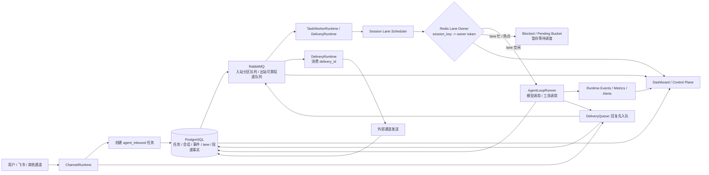

# 分布式入站任务调度架构说明

## 1. 问题背景

当前 Gateway 已经把入站消息、Agent 执行、出站投递拆成了多个阶段，但如果仍然把所有任务放进同一个严格 FIFO 队列里，就会出现一个典型问题：

```text
A1 -> A2 -> B1 -> C1
```

如果 `A2` 因为 session A 正在忙而不能执行，那么 `B1 / C1` 也会被队头阻塞拖住。

这说明：

- 仅靠 RabbitMQ 分区，不足以彻底解决热点 session 的阻塞问题。
- 必须把“消息排队”与“任务是否可执行”分开。

## 2. 设计目标

目标不是把所有消息都按顺序死等，而是实现：

- 同一 session 串行执行。
- 不同 session 尽量并行执行。
- 热点 session 只阻塞自己，不拖慢其他 session。
- 任务事实可恢复、可审计、可回放。

## 3. 可落地架构



## 4. 每一层的职责

### 4.1 ChannelRuntime

负责接收外部消息，做最初的归一化处理，然后把消息转成 `agent_inbound` 任务。

它的目标是“快进快出”，不要在入口同步等待模型执行。

### 4.2 PostgreSQL

负责保存事实：

- 任务状态。
- 会话历史。
- 事件流。
- lane owner 状态。
- 投递记录。

它是系统的事实中心，不负责实时调度。

### 4.3 RabbitMQ

负责分发和削峰：

- 把任务和投递消息异步化。
- 提供 ack / nack / DLQ。
- 作为 worker 唤醒机制。

但 RabbitMQ 不负责最终判断“这个任务此刻是否能执行”。

### 4.4 Session Lane Scheduler

这是关键调度层。

它不是简单消费队列，而是根据 session lane 的可用性挑选任务：

- lane 空闲 -> 放行执行。
- lane 忙 -> 暂存到 blocked / pending bucket。

它解决的是“不要让热点 session 卡死全局”。

### 4.5 Redis Lane Owner

负责 session 级互斥：

- 同一 session 同一时间只能有一个 owner。
- owner 需要续租。
- 释放和续租必须校验 token。
- TTL 到期后可以接管。

Redis 在这里不是队列，而是执行资格判断。

### 4.6 Blocked / Pending Bucket

当某个 session 当前不可执行时，任务不应该继续霸占全局队头，而应该进入等待池。

这样 scheduler 才能继续选择其他可执行 session。

## 5. 为什么这比单 FIFO 队列更合理

如果只用 RabbitMQ 分区队列，任务顺序会变成：

```text
A1 -> A2 -> B1 -> C1
```

在严格 FIFO 下：

- `A1` 正在执行时，`A2` 会等待。
- 如果 `A2` 卡住，`B1 / C1` 也会被挡住。

这意味着“热点 session”会拖慢整个分区。

而引入调度器后，顺序可以变成：

```text
A1 正在执行
A2 暂存
B1 先执行
C1 先执行
```

这样做到：

- 同 session 串行。
- 不同 session 并发。
- 热点局限在自己。

## 6. 方案三与方案四的区别

### 6.1 方案三：RabbitMQ 分区队列

核心是：

- 按 `session_key` 分桶。
- 同一个 session 进入同一个 partition queue。
- 由队列顺序提供近似串行。

它的强项是实现简单，但缺点也明显：

- 热点 session 会拖慢整个分区。
- 不能真正跳过队头阻塞。

### 6.2 方案四：Session Lane 调度

核心是：

- RabbitMQ 只负责唤醒和分发。
- 真正可执行的任务由 scheduler 选择。
- 被阻塞的 session 进入 pending bucket。
- Redis lane 保证同会话互斥。

它的本质不是“换个名字的分区队列”，而是把队列消费升级成调度决策。

## 7. 这个方案能解决什么

能解决：

- 同会话串行执行。
- 不同会话并行执行。
- 热点 session 不拖死全局。
- 任务事实可回放、可追踪。
- worker 崩溃后可接管。

不能仅靠 RabbitMQ 解决的：

- 队头阻塞。
- 热点 session 拖慢同分区其他 session。
- 严格 FIFO 带来的全局等待。

## 8. 面试时怎么回答

可以这样说：

> 如果所有任务都放在同一个 FIFO 队列里，那么同一个热点 session 的后续任务会卡住队头，连带拖慢别的 session。为了解决这个问题，我把 RabbitMQ 的职责限定为分发和唤醒，把 Redis 用作 session lane 的执行资格判断，再引入 scheduler 从可执行任务池里挑任务。这样同一会话仍然串行，但不会因为一个热点 session 把整个分区都堵住。

## 9. 总结

这套架构的核心思想是：

```text
队列负责存与送
lane 负责能不能执行
scheduler 负责先执行谁
PostgreSQL 负责记录事实
```

它比“单 FIFO 队列 + worker 抢消息”的模型更适合多实例、高并发、长会话的 AI Agent Gateway。

