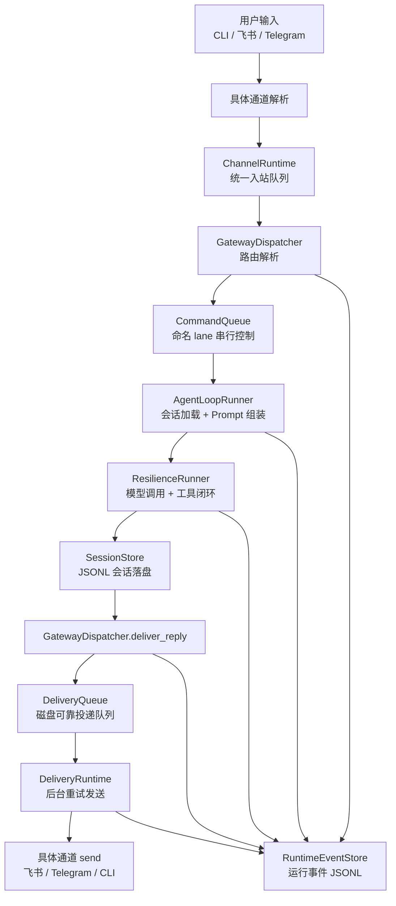

# 消息闭环实现说明

## 1. 难点概述

这个项目最大的难点不是某一个单点功能，而是把多通道接入、Agent 执行、可靠投递、主动任务和运维观测串成一个稳定闭环，同时还要尽量避免消息乱序、丢失、重复发送或通道之间互相阻塞。

项目的处理思路是：

- 统一消息模型：所有通道输入先标准化为 `InboundMessage`。
- 拆分调度边界：通道采集、路由、Agent 执行、投递发送分别由不同运行时负责。
- 引入队列：入站使用异步队列，出站使用磁盘可靠投递队列。
- 串行关键状态：同一会话通过命名 lane 串行执行，避免会话历史被并发写坏。
- 后台发送：普通回复、Cron、Heartbeat 都先落盘，再由 `DeliveryRuntime` 后台投递。
- 运行观测：关键节点写入 runtime event，Dashboard 可以按链路排查问题。

## 2. 总体链路



这条链路里，用户消息不是直接“模型返回后马上发送”，而是经过两段队列：

- 入站队列：解决多通道输入统一调度问题。
- 出站投递队列：解决发送失败、重试、进程中断和后台主动任务统一投递问题。

## 3. 第一段：通道采集与入站队列

相关实现：

- `agent_gateway/runtime/execution/channel_runtime.py`
- `ChannelRuntime.start`
- `ChannelRuntime._worker_loop`
- `ChannelRuntime._consume`
- `ChannelRuntime.ingest_external`

### 3.1 多通道输入如何统一

CLI、Telegram 这类通道会通过 `receive_batch()` 拉取消息。`ChannelRuntime.start()` 会为每个通道账号启动一个后台线程：

```text
channel-cli-local
channel-feishu-main
channel-telegram-main
```

这样做的原因是：通道的接收逻辑可能是阻塞式轮询，如果直接跑在 asyncio 主事件循环里，会阻塞整个网关。

### 3.2 线程如何把消息投递给协程

通道线程不能直接 `await` asyncio 队列，因此 `_worker_loop()` 使用：

```python
asyncio.run_coroutine_threadsafe(
    self._queue.put(PendingInbound(...)),
    self._loop,
).result()
```

这一步完成了线程到协程的桥接：

```text
通道线程
→ run_coroutine_threadsafe
→ asyncio 主事件循环
→ asyncio.Queue[PendingInbound]
```

飞书 HTTP Webhook 和飞书长连接已经在各自模块里完成协议解析，所以它们会直接调用 `ChannelRuntime.ingest_external()`，把标准化后的 `InboundMessage` 放进同一个队列。

### 3.3 CLI 为什么有 completion_event

CLI 和飞书/Telegram 不一样。飞书可以后台慢慢发送，但 CLI 用户正在终端里等待结果。如果回复还没刷出来，下一个输入提示符先出现，交互体验会错位。

因此 `PendingInbound` 有一个 `completion_event`：

```text
CLI 输入线程
→ 入队消息
→ 等待 completion_event
→ 消费者处理完成并 flush CLI 投递
→ set completion_event
→ CLI 才继续读取下一次输入
```

这解决了“提示符抢跑”和“需要多按一次回车”的问题。

## 4. 第二段：入站消费、拦截器与路由

相关实现：

- `ChannelRuntime._consume`
- `ChannelRuntime._handle_inbound`
- `InboundInterceptor`
- `GatewayDispatcher.dispatch_inbound`

### 4.1 单消费者顺序处理

当前 `ChannelRuntime._consume()` 是一个单消费者：

```text
while True:
    pending = await queue.get()
    await _handle_inbound(pending.message)
```

这样设计的好处是简单、稳定：所有消息在同一个进程内按顺序进入下游，降低并发写会话和投递队列的风险。

代价是：如果某条消息耗时很长，后面的消息会排队。因此项目计划中已经把 `ChannelRuntime Lane 化与入站背压` 提升为 Phase 15 的 P0 任务。

### 4.2 入站拦截器

进入普通 Agent 路由前，`ChannelRuntime._handle_inbound()` 会先执行 `inbound_interceptors`。

典型场景是飞书 onboarding：

```text
用户发送绑定码
→ FeishuOnboardingService.try_consume_activation()
→ 消息被消费
→ 不进入普通 Agent 对话
```

这样可以避免“绑定码”这类系统激活消息污染正常会话。

### 4.3 路由解析

如果没有被拦截器消费，消息会进入：

```python
GatewayDispatcher.dispatch_inbound(inbound)
```

这里做三件事：

1. 写入 `inbound.received` 运行事件。
2. 根据 `BindingTable` 解析目标 Agent 和 session。
3. 写入 `route.resolved` 运行事件。

路由结果决定：

- 由哪个 Agent 处理。
- 使用哪个 session_key。
- 后续会话历史写到哪个 JSONL 文件。

## 5. 第三段：命名 lane 与 Agent 执行

相关实现：

- `GatewayDispatcher.dispatch_inbound`
- `GatewayDispatcher._execute_lane_task`
- `CommandQueue.enqueue`
- `AgentLoopRunner.run_task_turn`

### 5.1 为什么需要命名 lane

同一个会话如果同时来了两条消息，不能并发写同一份历史文件，否则会出现上下文错乱。

因此 `dispatch_inbound()` 会把同一个 `session_key` 放进同一条命名 lane：

```python
reply = await self._execute_lane_task(
    lane_name=route.session_key,
    coroutine_factory=lambda: self.runner.run_turn(...)
)
```

这表示：

```text
同一个 session_key：串行执行
不同 session_key：具备后续并发优化空间
```

当前 lane 能保证同一会话顺序，但入站消费仍是全局单消费者，所以 Phase 15 要进一步把 `ChannelRuntime` 也 lane 化，避免不同通道互相阻塞。

### 5.2 Agent Loop 做了什么

`AgentLoopRunner.run_task_turn()` 是一次 Agent 回合的核心：

```text
加载历史消息
→ 追加本轮用户输入
→ 计算可用工具
→ 组装 system prompt
→ 调用 ResilienceRunner
→ 模型多轮 tool calling
→ 用完整 messages 重写会话 JSONL
→ 返回 AgentReply
```

核心落盘点是：

```python
self.sessions.rewrite_messages(agent_id, session_key, result.messages)
```

也就是说，会话不是只保存最终回答，而是保存模型返回后的完整消息历史，包括工具调用和工具结果，方便下次上下文恢复。

## 6. 第四段：模型调用与工具闭环

相关实现：

- `AgentLoopRunner.run_task_turn`
- `ResilienceRunner.run`
- `ToolRegistry.dispatch`
- `register_builtin_tools`

Agent 执行不是单次模型调用，而是围绕 `stop_reason` 的闭环：

```text
模型返回 tool_use
→ ToolRegistry 找到对应工具
→ 执行 bash / read_file / write_file / memory_search / web_search 等工具
→ 工具结果追加回 messages
→ 再次调用模型
→ 直到 stop_reason=end_turn
```

这个设计把“模型推理”和“外部执行”连接起来，形成可持续运行的 Agent Loop。

为了稳定性，模型调用不是直接裸调，而是经过 `ResilienceRunner`：

- 支持 profile 选择。
- 支持 fallback 模型。
- 支持错误分类。
- 支持工具事件记录。
- 支持上下文溢出后的压缩策略。

## 7. 第五段：会话落盘

相关实现：

- `SessionStore.session_path`
- `SessionStore.append_message`
- `SessionStore.rewrite_messages`
- `SessionStore.load_messages`

会话存储使用 JSONL：

```text
data/sessions/agents/<agent_id>/<session_key>.jsonl
```

JSONL 的好处是：

- 追加写简单。
- 崩溃后容易恢复。
- 可以人工排查。
- 可以逐行重放。

主链路中通常使用 `rewrite_messages()`，因为 Agent Loop 完成后，模型侧返回的是包含工具调用闭环的完整 `messages`。用完整历史覆盖会话，可以保证下一轮对话看到的是模型实际执行后的状态。

## 8. 第六段：出站可靠投递队列

相关实现：

- `GatewayDispatcher.deliver_reply`
- `GatewayDispatcher.deliver_text`
- `DeliveryQueue.enqueue`
- `DeliveryRuntime.flush_once`
- `DeliveryRuntime._deliver_entry`

### 8.1 为什么不直接 send

如果 Agent 得到回复后直接调用 `channel.send()`，会有几个问题：

- 发送失败后难以重试。
- 进程中断时消息会丢。
- Cron、Heartbeat、普通回复三条链路会分散。
- Dashboard 无法统一展示投递状态。

因此项目采用“先落盘，再后台发送”的模式：

```python
delivery_id = await asyncio.to_thread(
    self.delivery_queue.enqueue,
    result.inbound.channel,
    result.inbound.peer_id,
    result.reply.text,
    metadata,
)
```

这里还用了 `asyncio.to_thread()`，因为 `DeliveryQueue.enqueue()` 是文件写入操作。放到线程中执行，可以避免阻塞 asyncio 主循环。

### 8.2 DeliveryQueue 如何落盘

`DeliveryQueue.enqueue()` 会生成 `delivery_id`，构造 `QueuedDelivery`，然后写入磁盘：

```text
data/delivery-queue/pending/*.json
```

每条队列消息包含：

- channel
- to
- text
- metadata
- retry_count
- created_at
- next_attempt_at

这样即使进程重启，未发送消息也还在磁盘上，可以继续投递。

### 8.3 DeliveryRuntime 如何后台发送

`DeliveryRuntime` 有一个后台循环：

```text
while not stopped:
    await flush_once()
    await asyncio.sleep(poll_interval)
```

`flush_once()` 会取出 pending 消息，然后 `_deliver_entry()` 找到对应通道并调用：

```python
channel.send(outbound)
```

发送成功：

```text
DeliveryQueue.ack()
→ 删除 pending 文件
→ 写 delivery.sent 事件
→ 调用 on_success 回调
```

发送失败：

```text
DeliveryQueue.fail()
→ 增加 retry_count
→ 计算 next_attempt_at
→ 达到阈值后移动到 failed/
→ 写 delivery.failed 事件
```

## 9. 第七段：主动任务如何复用同一闭环

相关实现：

- `AutonomyRuntime`
- `HeartbeatService`
- `CronService._run_job`
- `GatewayDispatcher.dispatch_background`
- `GatewayDispatcher.deliver_text`

Cron 和 Heartbeat 没有用户实时输入，但它们复用同一套执行和投递链路。

以 Cron 为例：

```text
CronService._run_job
→ 根据 payload kind 决定 agent_turn / system_event / news_digest
→ agent_turn 走 dispatch_background
→ 得到输出后调用 dispatcher.deliver_text
→ DeliveryQueue 落盘
→ DeliveryRuntime 后台发送
```

这样普通用户消息、健康检查、新闻简报、GitHub Skill 推荐都走同一个可靠投递模型。

重要细节：

- Cron 会写 `cron.triggered`、`cron.completed` 或 `cron.failed`。
- Cron 默认禁用 `memory_write`，避免后台任务污染长期记忆。
- Cron 运行日志会写到 `workspace/cron/cron-runs.jsonl`。

## 10. 第八段：运行事件与观测

相关实现：

- `RuntimeEventStore.record`
- `GatewayDispatcher._record`
- `AgentLoopRunner._record`
- `DeliveryRuntime._record_delivery_event`
- `CronService._record_cron_event`

系统关键节点会写入 JSONL 事件：

```text
data/events/runtime-events-YYYY-MM-DD.jsonl
```

典型事件包括：

- `inbound.received`
- `route.resolved`
- `agent.turn.started`
- `agent.turn.completed`
- `agent.turn.failed`
- `tool.call.started`
- `tool.call.completed`
- `tool.call.failed`
- `delivery.enqueued`
- `delivery.sent`
- `delivery.failed`
- `cron.triggered`
- `cron.completed`
- `cron.failed`
- `feishu.event.accepted`
- `feishu.event.ignored`
- `feishu.event.rejected`

每条事件包含：

- type
- status
- component
- correlation_id
- agent_id
- session_key
- channel
- account_id
- peer_id
- delivery_id
- job_id
- error
- metadata

`correlation_id` 是排障关键：一次飞书消息从入站、路由、Agent 执行、工具调用、投递入队到发送完成，都可以用同一个 `correlation_id` 串起来。

## 11. 稳定性设计总结

### 11.1 不乱序

- 同一会话使用 `session_key` 作为 lane。
- Agent 执行通过 `CommandQueue` 串行。
- 会话历史由 `SessionStore` 统一写入。

### 11.2 不丢消息

- 入站消息进入 `asyncio.Queue`。
- 出站消息进入 `DeliveryQueue` 磁盘队列。
- 投递失败后按 retry_count 重试。
- 失败超过阈值进入 `failed/`，可通过控制面 retry/discard。

### 11.3 不让用户无反馈

- 入站处理异常后，`ChannelRuntime._deliver_error_reply()` 会尝试发错误提示。
- CLI 会主动 flush 投递，保证用户在终端中看到结果。
- Telegram 支持 typing 状态，降低等待焦虑。

### 11.4 可观测

- 每个关键节点写 runtime event。
- Dashboard 通过 `events.tail`、`errors.recent`、`metrics.*`、`alerts.*` 展示状态。
- 投递队列、Cron、告警和最近错误都能从控制面查看。

## 12. 当前限制与下一步优化

当前实现仍有一个明确限制：`ChannelRuntime` 的入站消费是全局单消费者。虽然下游 `GatewayDispatcher` 已经有基于 `session_key` 的命名 lane，但如果某条入站消息处理很慢，后面的消息仍然需要等待进入 `_consume()`。

因此项目计划中已经把 `Phase 15：ChannelRuntime Lane 化与入站背压` 提升为 P0：

- `restart()` 先修复 graceful drain，避免 reload 通道配置时丢未消费消息。
- 入站阶段改为按 `channel + account_id + peer_id` 或 `agent_id + session_key` 分 lane。
- 同一 lane 内串行，不同 lane 并发。
- 增加全局并发上限和 per-agent 并发上限。
- Dashboard 展示每个 lane 的队列长度、运行状态和最老等待时间。

## 13. 面试回答组织方式

可以把这个难点回答成三层：

第一层，说明难点：

> 难点不是接一个飞书或调一次模型，而是把多通道输入、Agent 多轮工具调用、主动任务、可靠投递和运维观测串成一个不会乱序、不会丢消息、出了问题能定位的闭环。

第二层，说明拆法：

> 我把系统拆成入站调度、路由执行、会话落盘、可靠投递和事件观测五段。入站用 `ChannelRuntime` 统一队列，执行用 `GatewayDispatcher + AgentLoopRunner`，同一会话用命名 lane 串行，出站统一写 `DeliveryQueue`，由 `DeliveryRuntime` 后台重试发送。

第三层，说明效果：

> 这样普通用户消息、飞书消息、CLI 消息、Cron 和 Heartbeat 都走同一套链路。消息可以落盘、重试、排查，Dashboard 也能按事件看到从入站到投递的全过程。
